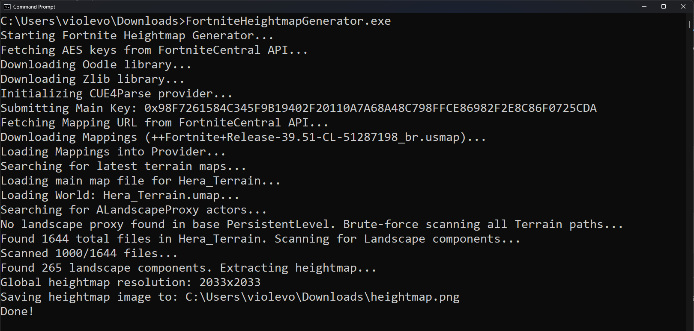

# Fortnite Heightmap Generator

This project is a C# CLI application that extracts heightmaps from fortnite game files. It uses the [CUE4Parse](https://github.com/FabianFG/CUE4Parse) library to parse encrypted unreal engine archives and [ImageSharp](https://github.com/SixLabors/ImageSharp) to generate the heightmaps from the parsed data. It also uses the FortniteCentral API to fetch the latest AES keys and mappings. I made this project to be used in within my [fortnite drop calculator](https://github.com/Violevo/FortniteHeightmapGenerator) project to improve accuracy, but feel free to use however you see fit! 


## Usage

### Option 1. Download the packaged binary

Download the packaged binary from the [releases](https://github.com/Violevo/FortniteHeightmapGenerator/releases) page.

Then run the application from the command line (or just double click the exe file):

```bash
./FortniteHeightmapGenerator.exe
```


### Option 2. Build the project from source

You can also build the project from source:

```bash
git clone https://github.com/Violevo/FortniteHeightmapGenerator
cd FortniteHeightmapGenerator
dotnet build
```

## Contributing & Licensing

Contributions, suggestions, and bug reports are always welcome. If you'd like to contribute to this project, please fork the repository, create a feature branch, and submit a pull request. This project is licensed under the GNU General Public License v3.0 - see the [LICENSE](LICENSE) file for more details.

### Credits

- [FortniteCentral](https://fortnitecentral.gg/) - For AES keys and mappings
- [CUE4Parse](https://github.com/FabianFG/CUE4Parse) - For parsing Unreal Engine archives
- [ImageSharp](https://github.com/SixLabors/ImageSharp) - For generating heightmaps
- [FortnitePorting](https://github.com/h4lfheart/FortnitePorting) - Helped with some of the heightmap logic

## Gallery


<p align="center">A generated heightmap of the current fortnite map.</p>



<p align="center">The console output of the application succeeding.</p>

